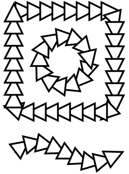
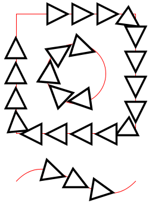

## jSVG Advanced Usage

### Decorators

Java2D has the option to iterate alone the outline of shapes (see [java.awt.geom.PathIterator](https://docs.oracle.com/javase%2F7%2Fdocs%2Fapi%2F%2F/java/awt/geom/PathIterator.html)).

With ShapePainter you can draw the SVG "along" the outline of some other shape.

Simple Example:

The SVG  is drawn along a rectangle, a circle and a curve.
To draw the SVG the base-position and the tangent angle along the outline is needed. Both values are calculated by 
[ShapeHelper.pointAtLength](../src/main/java/com/bw/jtools/svg/ShapeHelper.java).

Additionally, the painter can add space between the elements (here it is negative) and can add
offset to start- or end of the decorated paths. 
The same example with more gap and some offsets at start and end.

